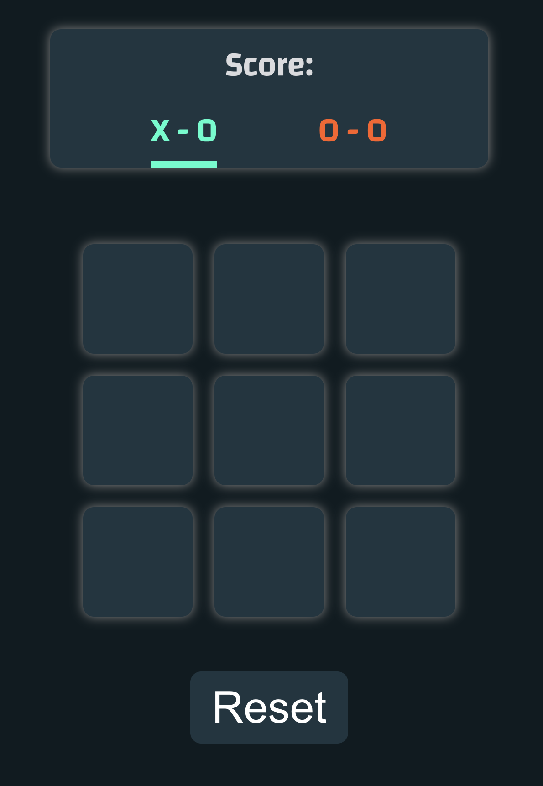
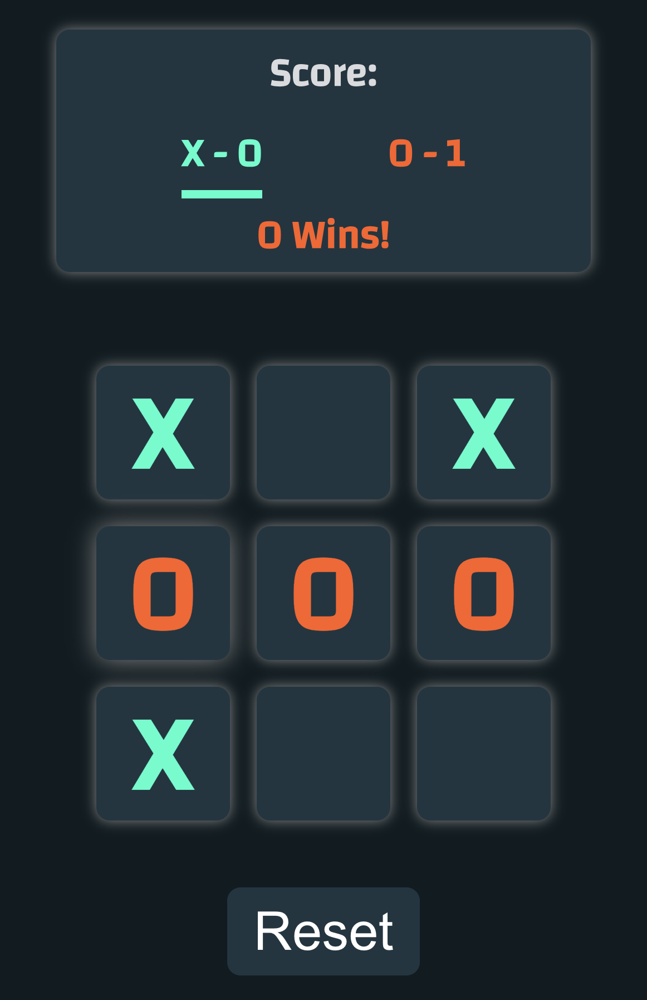

# Tic-Tac-Toe Game

## 🎮 Introduction

Welcome to the Tic-Tac-Toe game, a classic two-player game built using HTML, CSS, and React.js. This simple yet engaging project allows players to take turns marking spaces in a 3x3 grid with their respective symbols (X or O) to win the game. Enjoy the timeless experience of strategic gameplay with a modern twist.

## 🕹️ Play the Game

Experience the thrill of Tic-Tac-Toe by playing it live on [Tic-Tac-Toe App](https://maviakazi.github.io/Tic-Tac-Toe/) (Add your live app link here).

## 🧩 Game Features

-   Two players take turns marking spaces on the board with X or O.
-   The game ends when a player has three of their symbols in a row horizontally, vertically, or diagonally.
-   A notification displays the winner or a draw when the game concludes.
-   Simple and intuitive user interface for an enjoyable gaming experience.

## 🎨 Game Screenshots

### 🖥️ Game Board

### 🏆 Game Win

## 🚀 How to Play

1. Visit the [Tic-Tac-Toe App](https://maviakazi.github.io/Tic-Tac-Toe/).
2. Two players take turns clicking on an empty space on the board to place their symbol.
3. The game automatically checks for a winner or a draw after each move.
4. The game ends when a player wins or the board is full.

## 💻 Technologies Used

-   HTML
-   CSS
-   React.js

## 😃 Enjoyment and Challenges

Creating the Tic-Tac-Toe game was both enjoyable and challenging. Key highlights include:

-   Designing a clean and responsive user interface for a seamless gaming experience.
-   Implementing the game logic to accurately detect a winner or a draw.
-   Handling user interactions and ensuring smooth gameplay.

## 🌟 Next Steps

-   Adding a feature to reset the game for another round.
-   Implementing a score system to track player victories.
-   Enhancing the overall user interface for a more polished look.

## 📝 Developer Information

Developed by Mavia

For inquiries or feedback, contact me at mavia.salman.kazi@gmail.com.

Feel free to fork and contribute to the project. Happy gaming! 🎮
